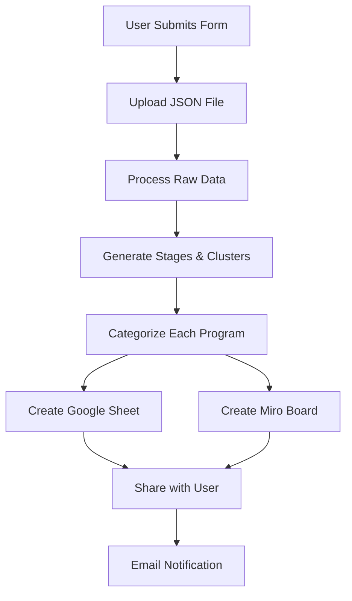

# 📚 n8n Lifecycle Atlas - Complete Handover Documentation
**Version:** 1.0

**Last Updated:** September 17, 2025

**Author:** @Pranav Kafle 

**Status:** Production Ready

---

## 🔍 **1. Overview & Objectives**

### **What is the Lifecycle Atlas?**

The Lifecycle Atlas is an AI-powered automation tool that analyzes Customer.io workspace data to automatically generate:
- **Customer Journey Maps** - Visual representation of all campaigns, newsletters, and transactional messages
- **Lifecycle Stage Categorization** - Automatic grouping into 8 lifecycle stages
- **Campaign Clustering** - Smart grouping of similar campaigns within each stage
- **Interactive Visualizations** - Miro mindmaps and Google Sheets analysis

### **Problem Being Solved**

CSMs spend hours manually reviewing customer workspaces to understand:
- What campaigns are running
- How they map to the customer lifecycle
- Where gaps exist in the customer journey
- Which campaigns serve similar purposes

This tool automates that analysis from hours to minutes.

### **Target Users**

- **Primary:** Customer Success Managers (CSMs)
- **Secondary:** Solution Architects, Technical Account Managers
- **Technical Level Required:** Basic (can follow instructions, no coding needed)

### **Success Metrics**

✅ **Success looks like:**
- CSMs are creating journey maps automatically
- Using maps to have strategic conversations with customers
- Identifying gaps and opportunities for campaign optimization
- Driving actionable outcomes from the analysis
- Analysis completed in <10minutes (vs. 2-4 weeks manually)

---

## 🛠 **2. Tooling & Access Setup**

### **Required Tools & Access**

| Tool | Purpose | Access Required | Who to Contact |
| --- | --- | --- | --- |
| **n8n** | Workflow automation platform | Tailscale access required for editing | DevOps team |
| **Google Cloud Project** | “Lifecycle Atlas” project (migrating to CIO internal) | Project access permissions | Terrence Brown |
| **Google Gemini API** | AI analysis engine | API key with Gemini 2.0 Flash & 2.5 Pro access | Terrence Brown |
| **Google Workspace** | Sheets creation & sharing | OAuth2 credentials (Client ID & Secret) | Terrence Brown |
| **Miro** | Visual mindmap creation | Company dashboard access + license + developer space | Alvin (IT) |
| **Customer.io** | Data source | Masq access to customer workspaces | CSM & Customer.io |

### **Step-by-Step Access Setup**

### **1. n8n Access**

```bash
# IMPORTANT: Requires Tailscale for access
1. Install Tailscale on your machine
2. Connect to the company VPN via Tailscale. Ask SRE team
3. Access n8n dashboard (Credentials stored in 1Password)
4. Import the workflow JSON file to test workflow.
Note: You can run analyses without editing n8n, but editing requires Tailscale connection
```

### **2. Google Cloud Project Setup**

1. Contact **Terrence Brown** for access to Google Cloud
2. Navigate to **“Lifecycle Atlas”** project
    - Note: Migration to CIO internal projects in progress
3. Ensure these APIs are enabled:
    - Google Gemini API
    - Google Sheets API
    - Google Drive API
    - Gmail API
    - Generative AI
4. Obtain:
    - Client ID
    - Client Secret
    - API Key

### **3. Google Workspace OAuth Setup**

1. In Google Cloud Console (Lifecycle Atlas project):
    - Navigate to APIs & Services → Credentials
    - Create OAuth 2.0 Client ID
    - Add authorized redirect URIs
2. Configure credentials in n8n:
    - Google Sheets node
    - Google Drive node
3. Test authentication flow

### **4. Miro Access Setup**

1. Ensure you have Miro license
    - If not, request from **Alvin** (new IT person)
2. Access company Miro dashboard
3. OAuth tokens already configured in n8n workflow
4. CSMs automatically added as co-owners of boards

### **Permissions Checklist**

- [ ]  n8n workflow execution rights
- [ ]  Google Gemini API quota (Max rate as allowed & Max Context)
- [ ]  Google Sheets create/edit permissions
- [ ]  Google Drive file sharing permissions
- [ ]  Miro board creation rights
- [ ]  Customer.io workspace Masq access

---

## 📥 **3. Input Requirements**

### **Data Source: Customer.io Workspace Export**

The workflow requires a JSON export from Customer.io containing:
- **Campaigns** (with states: running, paused, stopped, archived)
- **Newsletters**
- **Transactional Messages**
- **Message metadata** (subjects, types, IDs)

### **Data Collection Process**

⚠️ **IMPORTANT COMPLIANCE STEPS:**

1. **Generate Export URL:**
    
    ```
    https://[datacenter].fly.customer.io/v1/environments/[env_id]/deliveries/filters
    ```
    
    Where:
    
    - `[datacenter]` = “us” or “eu”
    - `[env_id]` = Customer’s environment ID
    - **Requirement:** Must have read access to customer’s workspace
2. **Download & Upload Process:**
    - Click the generated link
    - Download JSON file to your computer
    - **Save it locally** (required for upload)
    - Upload to n8n form
    - **DELETE the file from your computer immediately** (compliance requirement)
3. **Required JSON Structure:**
    
    ```json
    {  "campaigns": [    {      "id": 123,      "name": "Welcome Series",      "state": "running"    }  ],  "newsletters": [...],  "transactional_messages": [...],  "messages": [...],  "branch_messages": [...]}
    ```
    

⚠️ **Known Issues with Large Files:**
- Processing is slower for bigger workspaces
- Very large files might timeout or fail
- If it fails, **wait a few hours and retry**
- No formal stress testing completed yet

### **Data Preparation Requirements**

✅ **No manual preparation needed** - The workflow handles everything:
- Filtering out archived/draft campaigns
- Deduplicating messages
- Cleaning null/undefined fields
- Normalizing data structure
- All cleaning happens automatically

⚠️ **Compliance Requirement:** Users MUST delete the downloaded JSON file after upload

---

## 🤖 **4. AI Workflow & Prompt Strategy**

### **AI Tools Configuration**

**Single AI Tool:** Google Gemini (via Google Cloud)
- **Models Used:** Gemini 2.0 Flash Lite & Gemini 2.5 Pro
- **Purpose:** Standardized output for all analyses
- **Temperature:** Default (0.7)
- **Max Retries:** 5 attempts with 5-second delays
- **Prompts:** Embedded within n8n workflow (also available in GitHub)

### **Two-Stage AI Analysis**

### **Stage 1: Cluster Generation**

**Prompt File:** `Generate Stages and Clusters.xml`

**Purpose:** Analyze all programs to create lifecycle stage structure

**Key Prompt Elements:**

```xml
<role>
  You are a senior lifecycle marketing strategist analyzing messaging data
  to identify lifecycle stages and campaign clusters.
</role>
<lifecycle_stages>
  Awareness - Grabbing attention and making first impressions
  Engagement - Building relationships and deeper connections
  Consideration - Helping prospects evaluate options
  Activation and Conversion - Moving prospects toward commitment
  Onboarding - Ensuring smooth first experiences
  Retention - Keeping existing customers engaged
  Loyalty and Advocacy - Rewarding best customers
  Reactivation and Win-back - Re-engaging drifted customers
</lifecycle_stages>
```

**Expected Output Format:**

```
Stage: Onboarding
Programs focused on welcoming new users and initial setup:

Clusters:
Welcome Series:
Automated emails sent immediately after signup
Product Setup:
Guides for initial configuration and integration
```

### **Stage 2: Individual Program Categorization**

**Prompt File:** `Message a model.xml`

**Purpose:** Categorize each program into the generated clusters

**Key Prompt Elements:**

```xml
<output_format>
  Output ONLY the categorization in this exact JSON format:
  {
    "program_name": "[Program Name]",
    "program_type": "[Campaign|Newsletter|Transactional]",
    "program_id": "[ID]",
    "lifecycle_stage": "[Stage Name]",
    "cluster": "[Cluster Name]",
    "reasoning": "[One line explanation]"
  }
</output_format>
```

### **Key Innovation: Individual Program Processing**

**Why it works:**
- Each program is sent to Gemini individually (one at a time)
- This eliminates hallucination issues
- Ensures consistent categorization
- Creates standardized output across all analyses

### **Output Standardization**

✅ **Every analysis looks identical:**
- Same structure
- Same format
- Same visualization
- No variation between customers

**Manual Refinement:** If needed, refinements are done directly in Miro after generation

### **Handling AI Responses**

The workflow includes automatic:
- JSON extraction from responses
- Error handling for malformed JSON
- Retry logic for failed requests
- Cleaning of markdown artifacts
- Validation and iteration through code

---

## 🧭 **5. End-to-End Process Flow**

### **Complete Workflow Sequence**



### **Detailed Step-by-Step Process**

### **Step 1: Form Submission**

**Node:** “On form submission”
- User provides:
- Name & Email
- Company Name
- Environment ID
- Data Center (US/EU)

### **Step 2: File Upload**

**Node:** “Form”
- Dynamic URL generated for data download
- User uploads JSON file
- File validated and processed

### **Step 3: Data Processing**

**Node:** “Process Raw Data”
**Code File:** `Process Raw Data.js`

```jsx
// Key operations:- Parse uploaded JSON- Filter out archived/draft campaigns
- Clean message data
- Structure into programs array
```

### **Step 4: AI Analysis - Stage 1**

**Node:** “Generate Stages and Clusters”
- Analyzes all programs collectively
- Creates lifecycle stage structure
- Generates cluster descriptions

### **Step 5: AI Analysis - Stage 2**

**Node:** “Message a model”
- Processes each program individually
- Assigns to specific stage & cluster
- Provides reasoning for categorization

### **Step 6: Data Aggregation**

**Node:** “Aggregate”
- Collects all AI responses
- Validates JSON structure
- Prepares for output generation

### **Step 7: Google Sheets Creation**

**Nodes:** Multiple sheet operations
- Creates spreadsheet with 2 tabs:
- **Comprehensive:** All programs with categorization
- **Summary:** Cluster x Stage matrix with counts

### **Step 8: Miro Board Creation**

**Nodes:** Multiple Miro operations
- Creates interactive mindmap
- Central node → Stages → Clusters → Types → Examples
- Auto-layouts for readability [This has to be done manually due to Experimental API by Miro]

### **Step 9: Sharing & Notification**

- Google Sheet shared with user email
- Miro board shared with edit access
- Email notification sent with links

### **Processing Timeline**

| Phase | Duration | Actions |
| --- | --- | --- |
| Data Collection | 30 sec | Form submission & file upload |
| Processing | 45 sec | Data cleaning & structuring |
| AI Analysis | 60-90 sec | Dual-stage categorization |
| Output Generation | 30 sec | Sheets & Miro creation |
| **Total** | **3-4 minutes (longer for large workspace)** | Complete analysis |

---

## 🧩 **6. Output & Deliverables**

### **Deliverable 1: Google Sheets Analysis**

**Location:** Shared to CSM’s email at [name]@customer.io
**Storage:** Also saved in company Google Drive

**Tab 1: Comprehensive Analysis**

```json
| Column | Description | Example |
|——–|————-|———|
| program_name | Full campaign name | “Welcome Email Series” |
| program_type | Campaign/Newsletter/Transactional | “Campaign” |
| program_id | Unique identifier | “12345” |
| lifecycle_stage | One of 8 stages | “Onboarding” |
| cluster | Grouped category | “Welcome Messages” |
| reasoning | AI explanation | “New user welcome flow with setup instructions” |
```

**Tab 1: Summary Matrix**

```
Clusters         | Onboarding | Retention | Reactivation | ... | Total
-----------------|------------|-----------|--------------|-----|-------
Welcome Series   |     5      |     0     |      0       | ... |   5
Product Updates  |     0      |     8     |      0       | ... |   8
Win-back         |     0      |     0     |      12      | ... |  12
TOTAL           |     5      |     8     |      12      | ... |  25
```

### **Deliverable 2: Miro Visual Mindmap**

**Location:** Company Miro dashboard (CSMs added as co-owners)

⚠️ **CRITICAL: Initial Display Issue**
When first created, the mindmap will appear **messy and overlapped**. This is normal! 

**Required Manual Fix:**
1. Open the Miro board
2. Select the central node
3. Click change theme and select horizontal or vertical button to trigger auto-layout.
4. Manually drag nodes to position:
- Center node in the middle
- Drag some branches left, some right
- Creates balanced visualization

[CleanShot 2025-09-17 at 14.45.47.mp4](attachment:00df3e5c-85cd-49dd-acd3-0572aaf0efe2:CleanShot_2025-09-17_at_14.45.47.mp4)

**Why this happens:**
- Cannot control X/Y axis programmatically in Miro
- All nodes initially stack on the right side
- Manual adjustment takes 30 seconds.

**Final Structure (after manual fix):**

```
[Company Name] Lifecycle Atlas (86)
├── Onboarding (15)
│   ├── Welcome Series (8)
│   │   ├── Campaigns (5)
│   │   │   └── "Welcome Email Day 1"
│   │   └── Newsletters (3)
│   └── Product Setup (7)
├── Retention (25)
│   └── [clusters...]
└── [other stages...]
```

**Access Issues:**
- If you cannot edit the board = **You don’t have a Miro license**
- Solution: Request license from **Alvin** (IT)

### **Deliverable 3: Email Notification**

**Contents:**
- Direct links to both outputs
- Access instructions
- Completion confirmation
- Support channel reference

### **Output Usage Guidelines**

| Use Case | Recommended Output | Why |
| --- | --- | --- |
| Executive Summary | Miro Mindmap | Visual, high-level overview |
| Gap Analysis | Google Sheets Summary | Easy to spot empty cells and build charts |
| Campaign Audit | Google Sheets Comprehensive | Full details with reasoning |
| Team Workshop | Miro Board | Collaborative exploration |
| QBR Preparation | Both | Complete picture |

---

## 🚧 **7. Challenges & Decisions**

### **Known Issues & Friction Points**

| Challenge | Impact | Workaround | Status |
| --- | --- | --- | --- |
| **Manual file handling** | CSM must download, save, upload, delete | Clear instructions provided | 📍 By Design |
| **Large file processing** | Slower processing, possible timeouts | Wait and retry after few hours | ⚠️ Known Issue |
| **Miro initial display** | Mindmap appears overlapped and messy | Manual auto-layout + positioning required | 📍 By Design due to Miro API Limitations |
| **Miro licensing** | CSMs cannot edit without license | Request from Alvin (IT) | 📍 Process Issue |
| **No stress testing** | Unknown limits for very large workspaces | Test with smaller workspace first | 🔄 In Progress |
| **Email delays** | Sometimes takes hours to receive | Retry if no email after 2-3 hours | ⚠️ Known Issue |

### **Key Technical Decisions**

### **Decision 1: Why All Google-Based Architecture?**

- **Compliance:** Easier approval process for single vendor
- **Integration:** Everything works seamlessly together
- **Access:** Single Google Cloud project controls everything
- **Simplicity:** No need for ChatGPT or other external APIs

### **Decision 2: Why Manual File Download/Upload?**

- **Compliance:** Data security requirements
- **Access:** Direct API integration not yet available
- **Control:** CSM maintains data custody throughout

### **Decision 3: Why Individual Program Processing?**

- **Accuracy:** Eliminates AI hallucination completely
- **Consistency:** Every output looks identical
- **Reliability:** Predictable results every time

### **Workarounds & Tips**

**💡 Pro Tips:**

1. **Handling Special Characters in Campaign Names**
    
    ```jsx
    // Already handled in Process Raw Data.jsprogram_name: c.name.replace(/[^\w\s-]/g, '')
    ```
    
2. **Dealing with Empty Responses**
    - Set retry count to 5
    - Add 5-second delays between retries
    - Use Gemini 2.5 Pro as fallback
3. **Optimizing for Large Workspaces**
    - Process in batches of 50 programs
    - Use Split Out node for parallel processing
    - Cache cluster definitions
4. **Debugging Failed Runs**
    - Check n8n execution logs
    - Validate JSON structure at each step
    - Test with smaller dataset first

### **Common Error Messages & Solutions**

| Error | Cause | Solution |
| --- | --- | --- |
| “No usable input found” | Malformed JSON upload | Verify JSON structure, re-export from Customer.io |
| “Stage not found in tree” | AI hallucination | Restart workflow, stages will regenerate |
| “Rate limit exceeded” | Too many API calls | Wait 60 seconds, retry with smaller batch |
| “Invalid JSON in response” | AI added markdown | Cleaning functions already handle this |

---

## 📈 **8. Results & Metrics**

### **Pilot Performance Metrics**

**Testing Period:** August - September 2025

**Key Success Story:** Gelato implementation by Stefano
**Status:** Successful pilot, iterating based on feedback

### **Quantitative Results**

| Metric | Before (Manual) | After (Automated) | Improvement |
| --- | --- | --- | --- |
| **Analysis Time** | 2-4 weeks | 3-4 minutes | 99.9% reduction |
| **Coverage** | 10-20% reviewed | 100% reviewed | 5-10x increase |
| **Sharing Time** | 30 min formatting | Instant | 100% reduction |

### **Qualitative Findings**

✅ **What Worked Well:**
- Stefano successfully used for Gelato account review
- Standardized output format across all analyses
- Eliminated manual categorization work
- Created foundation for strategic conversations

⚠️ **Key Learning:**
- Users (Elena) wanted more data-driven insights, not just visualizations
- Led to complete workflow revamp and iteration
- Added comprehensive data tables alongside visual maps

### **Customer Feedback Highlights**

> “We inspired them [Gelato], and they're now planning to run API calls to get content for their key campaigns, run it through their AI tool and see what suggestions it shares” -  Stefano, Sr. CSM
> 

---

## 🔄 **9. Future Considerations & Next Steps**

### **Immediate Next Steps (Next Sprint)**

**What’s Incomplete:**
- [ ] **Summary Generation:** AI-powered analysis of gaps and recommendations
- [ ] **Industry Insights:** “If this is missing in this industry, what else could they do?”
- [ ] **Campaign Analysis:** Specific improvements for individual campaigns
- [ ] **Comparative Analysis:** Benchmarking against similar customers

### **Scaling Roadmap**

### **Phase 1: Automation Enhancement** (Q4 2025)

- Scheduled weekly runs for key accounts
- Automatic gap detection alerts
- Comparison with previous analyses

### **Phase 2: Intelligence Layer** (Q1 2026)

- Predictive campaign recommendations
- Industry benchmark comparisons
- ROI estimation per campaign

### **Phase 3: Full Integration** (Q2 2026)

- Direct Customer.io API integration
- Salesforce/Planhat opportunity mapping
- Automated QBR deck generation

### **Technical Improvements for Scale**

**Requirements:**
- More powerful n8n infrastructure (current setup can be slow)
- Better handling of large files
- Stress testing for enterprise workspaces
- Direct Customer.io API integration

| Component | Current State | Desired State | Priority |
| --- | --- | --- | --- |
| **Infrastructure** | Basic n8n instance | Enhanced server capacity | High |
| **File Handling** | Unknown limits | Support for any size | High |
| **Processing** | Single-threaded | Parallel processing | Medium |
| **Storage** | Google Drive | Versioning and History | Low |

### **Ownership & Maintenance**

**Current Owner:** @Pranav Kafle 

**Ideal Future Owner Profile:**
- **Role:** Customer Success Engineer (or similar technical CSM role)
- **Skills Required:**
- Comfortable with n8n workflows
- Experience with Google Cloud and APIs
- Understanding of Miro API
- JavaScript proficiency
- Customer-facing experience

**Why CSE is ideal:** Combines technical skills with customer understanding

### **Prerequisites for Scaling**

1. **Infrastructure:**
    - Dedicated n8n instance
    - Increased Gemini API quota
    - Database for historical data
2. **Process:**
    - Formal training program
    - Documentation in Confluence
    - Quarterly review cycles
3. **Governance:**
    - Data retention policy
    - Access control matrix
    - Compliance review

---

## 🔁 **10. Support Materials**

### **Storage & Version Control**

**Document Storage:** Google Drive (CSM folder)
**Version Control:** Automatic - filenames include date stamp
**Code Repository:** GitHub (all prompts and code uploaded)

**File Naming Convention:**`[Company Name] Lifecycle Atlas [YYYY-MM-DD]`
Example: `Gelato Lifecycle Atlas 2025-09-15`

**Backup Locations:**
- Google Drive: Shared with CSM team
- Miro: Company dashboard
- GitHub: All code and prompts

### **Support Materials Included**

### **📁 Code Files (7 files)**

All JavaScript processing logic extracted from n8n nodes:
- `Process Raw Data.js` - Data normalization
- `Comprehensive Program Analysis.js` - JSON extraction
- `Summary Analysis.js` - Matrix generation
- `Stage Mapper.js` - Miro stage nodes
- `Cluster Mapper.js` - Miro cluster nodes
- `Type Mapper.js` - Miro type nodes
- `Examples Mapper.js` - Miro examples

### **📝 Prompt Templates (2 files)**

- `Generate Stages and Clusters.xml` - Initial analysis
- `Message a model.xml` - Individual categorization

### **🔧 Configuration Files**

- `n8n Lifecycle Atlas.json` - Complete workflow (import-ready)
- `.env` - Environment variables template

### **Training Resources**

### **Video Walkthroughs**

1. **[Loom: Complete Workflow Demo]** (15 min)
    - End-to-end process
    - Common issues
    - Tips & tricks
2. **[Loom: Troubleshooting Guide]** (10 min)
    - Error messages
    - Debug process
    - Support escalation

### **Quick Reference Guides**

**Support Channels:**
- Slack: #csm-ai-champions

### **Maintenance Checklist**

**Weekly:**
- [ ] Check API quotas
- [ ] Review error logs

**Monthly:**
- [ ] Refresh OAuth tokens
- [ ] Archive old analyses
- [ ] Review usage metrics

**Quarterly:**
- [ ] Update AI prompts
- [ ] Optimize performance
- [ ] Gather user feedback

---

## 📎 **Appendices**

### **Appendix A: Complete File Structure**

```
n8n-lifecycle-atlas/
├── n8n Lifecycle Atlas.json          # Main workflow
├── Process Raw Data.js               # Data processing
├── Comprehensive Program Analysis.js # JSON extraction
├── Summary Analysis.js               # Matrix generation
├── Stage Mapper.js                   # Miro stages
├── Cluster Mapper.js                 # Miro clusters
├── Type Mapper.js                    # Miro types
├── Examples Mapper.js                # Miro examples
├── Generate Stages and Clusters.xml  # AI prompt 1
├── Message a model.xml               # AI prompt 2
├── .env                              # Environment vars
└── HANDOVER_DOCUMENTATION.md         # This document
```

### **Appendix B: Lifecycle Stages Reference**

| Stage | Description | Typical Campaigns |
| --- | --- | --- |
| **Awareness** | First impressions | Brand campaigns, content marketing |
| **Engagement** | Building relationships | Newsletter, community |
| **Consideration** | Evaluation phase | Product demos, comparisons |
| **Activation & Conversion** | Purchase decision | Trials, offers, urgency |
| **Onboarding** | First experience | Welcome, setup, training |
| **Retention** | Ongoing engagement | Product updates, tips |
| **Loyalty & Advocacy** | Champion development | Rewards, referrals, VIP |
| **Reactivation & Win-back** | Re-engagement | Dormant user, churn prevention |

### **Appendix C: Common Issues & Quick Fixes**

**🔴 Issue 1: No email received after hours**
- **Solution:** Retry the entire process
- **Wait time:** 1 hour before retry
- **If persists:** Check with Terrence Brown

**🔴 Issue 2: Miro board looks completely messy**
- **This is NORMAL!**
- **Fix:** Select central node → Change Direction for Auto Layout → Manual positioning
- **Time needed:** 2-3 minutes

**🔴 Issue 3: Cannot edit Miro board**
- **Cause:** No Miro license
- **Solution:** Contact Alvin for license

**🔴 Issue 4: Large file timeout**
- **Solution:** Wait a few hours and retry
- **Alternative:** Test with smaller workspace first

**🔴 Issue 5: File upload fails**
- **Check:** File must be saved locally first
- **Check:** File size (very large files may fail)
- **Solution:** Download → Save → Upload → Delete

```
Quick Troubleshooting Flow:
No Email? → Wait 1 hour → Retry
Miro Messy? → Auto Layout → Manual fix
Can't Edit? → Get Miro license from Alvin
Large File? → Wait and retry later
Upload Fails? → Save file locally first
```

### **Appendix D: Security & Compliance**

**Data Handling Requirements:**
1. Customer data must be deleted after processing
2. No PII stored in logs or outputs
3. All API keys encrypted in n8n
4. Access logs maintained for audit

**GDPR Compliance:**
- ✅ Data minimization (only metadata processed)
- ✅ Purpose limitation (analysis only)
- ✅ Storage limitation (immediate deletion)
- ✅ Security measures (encrypted transmission)

---

---

## 📞 **Contact & Support**

**Primary Contact:** @Pranav Kafle 

**Slack Channel:** #csm-ai-champions

**Documentation:** This document

**Code Repository:** GitHub: https://github.com/pranavkafle/n8n-lifecycle-atlas

**Emergency Contacts:**
- Credential Issues: **Terance Brown** (Slack)
- Access Issues: IT Support
- Customer Issues: CS Leadership

---

**Document Version:** 1.0

**Last Updated:** September 17, 2025

**Next Review:** October 17, 2025

**Status:** ✅ Production Ready

---